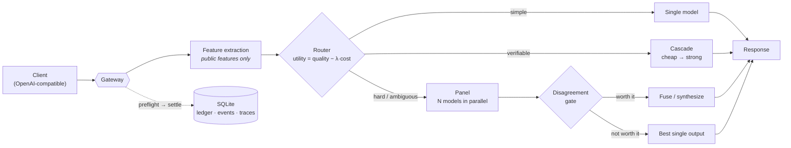

# ⚡ Fusion Gateway

**An OpenRouter-style, industrial-grade LLM fusion gateway.**
One OpenAI-compatible endpoint that routes, cascades, and *fuses* models —
and only pays for fusion when it actually buys quality.

---

## The one-paragraph version

Dynamic routing reliably saves **cost and latency** — but naive multi-model
**fusion usually fails to beat the single best model on quality**. Fusion
Gateway treats that gap as the whole problem. It reads only *public* task
features, decides between a single model, a cheap→strong **cascade**, or a
multi-model **panel**, and fuses panel outputs **only when a learned
disagreement gate says the extra spend pays off**. Every fusion or cascade
point must **expand the cost–quality Pareto frontier or get cut**.

## How a request flows

Judges and reference answers **never** enter routing inputs. Every decision,
provider call, cost, and latency is written to an append-only, **replayable**
event log.

## Why it's built this way

| Principle | What it means here |
|---|---|
| 🎯 **Pareto-SOTA, or it doesn't ship** | The dynamic policy's cost/quality curve must *envelope* every static single-model baseline — the bar a router has to clear to earn its complexity. |
| 🧾 **SQLite is the only truth** | Append-only, parent-linked, deterministically replayable traces; a cost **ledger** does `preflight → settle` on every real call. |
| 🛑 **Budgets that actually stop** | Per-milestone caps, alert at 80%, **kill switch trips at 100%** — cleared only by explicit admin action. |
| 🔒 **Leakage is a test failure** | Group-by-task validation; benchmark IDs are never routing features; a judge must clear a repeat-scoring stability floor before its labels are trusted. |
| 💸 **Fusion must earn its cost** | A learned gate decides *whether* to fuse; a fusion point that doesn't push the frontier out is removed, not kept "just in case." |

## Design & decisions

- 📐 **[docs/DESIGN.md](docs/DESIGN.md)** — architecture, milestones (M0→M6), and the falsifiable acceptance criteria.
- 🧭 **[docs/DISCIPLINES.md](docs/DISCIPLINES.md)** — the engineering rules the code is held to, and *why* each one exists.
- 🗂️ **[docs/adr/](docs/adr/)** — architecture decision records.

## Roadmap

| Milestone | Focus | Exit criterion |
|:--:|---|---|
| **M0** ✅ | Governance, disciplines, decision records | Repo + disciplines in place |
| **M1** 🚧 | Minimal production gateway | Real traffic, 1 week, no gateway-caused incidents |
| **M2** | Stable evaluation harness (≥1000 objective tasks) | Judges pass a repeatability floor |
| **M3** | Cost-aware router training | Learned curve envelopes every static policy |
| **M4** | Cascade + learned fusion gate | Fusion/cascade expands the Pareto frontier |
| **M5** | Reproducible SOTA benchmark report | Beats a public router baseline on the same suite |
| **M6** | Productionization (shadow → rollout) | Trained policy carries real traffic |

## Tech

Python 3.10+ · FastAPI · httpx · SQLite (WAL) · no ORM, no queue, no Docker —
the gateway is a single async process whose truth lives in one SQLite file.

## Status

Early and moving. **M0** (governance, disciplines) is done; **M1** (the minimal
production gateway) is under active, test-driven development.

## License

TBD.
