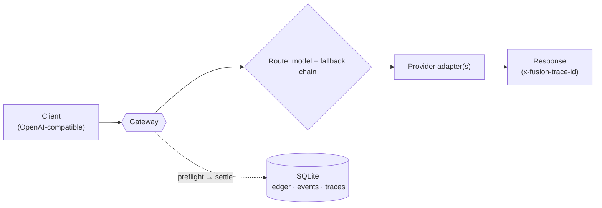

<div align="center">

# ⚡ Fusion Gateway

**An OpenRouter-style, self-hosted LLM gateway.**
One OpenAI-compatible endpoint in front of many models — with per-call cost
accounting, budget kill-switch, replayable traces, and automatic fallback.
Its research goal is **cost-quality Pareto-SOTA** routing and fusion.


</div>

---

## What you get today

A single async gateway that speaks the **OpenAI Chat Completions API** (streaming
and non-streaming) and, per request:

- **routes** a model name to a primary + **fallback** chain (a provider outage
  falls through to the next model instead of erroring);
- **meters cost** on every call with a `preflight → settle` ledger, and **trips a
  kill-switch** when a budget cap is hit;
- writes an **append-only, replayable trace** of every decision, call, cost, and
  latency to a single SQLite file.

The learned cost-aware **routing / cascade** (the namesake) is **validated on the
benchmark** — it Pareto-dominates the frontier single models (see
[Results](#results--cost-quality-pareto-sota)); wiring the trained policy into the
live gateway is the remaining step.

## Results — cost-quality Pareto SOTA

On a 1063-task objective benchmark scored with **official** graders (Hendrycks
MATH `is_equiv`, TIGER-Lab MMLU-Pro extraction, OpenAI HumanEval — **no LLM
judge**), the learned cost-aware router **Pareto-dominates** the frontier singles:

| strategy | accuracy | cost/task | reading |
|---|---|---|---|
| **router @ λ=10** | **0.907** | **$0.00106** | dominates GPT-5.5 / Sonnet 5 / GLM |
| claude-opus-4-8 (quality ceiling) | 0.913 | $0.00421 | router ≈ Opus at ~4× lower cost |
| deepseek-chat (cost floor) | 0.859 | $0.00011 | cheapest |
| **code verify-cascade** | **0.994** | ~$0.0005 | run-cheap → execute tests → escalate |

A separate **hard / contamination-resistant tier** (657 timestamped tasks:
LiveCodeBench + GPQA-Diamond + AIME 2024/25 + MATH-L5) de-ties the saturated
frontier, and a **SWE-bench-Live agentic tier** (long-horizon, real GitHub
issues) is under construction — carrying the same *cost per successful task*
discipline from single-turn benchmarks to real work.

Full numbers: **[docs/BENCHMARK_REPORT.md](docs/BENCHMARK_REPORT.md)** ·
hard tier **[docs/HARD_TIER_REPORT.md](docs/HARD_TIER_REPORT.md)** ·
positioning vs OpenAI's *"Useful Intelligence per Dollar"* scorecard
**[docs/POSITIONING.md](docs/POSITIONING.md)**.

## Quick start

```bash
git clone https://github.com/coderdailyone/fusion-gateway.git
cd fusion-gateway
python3 -m venv .venv
.venv/bin/pip install -e .
```

Set your provider key(s) and an auth token, then run the gateway:

```bash
export DEEPSEEK_API_KEY=sk-...            # a key for each provider in your config
export GATEWAY_TOKENS="me:secret-token"   # client-token:principal pairs
.venv/bin/uvicorn --factory gateway.app:create_app_from_env --host 127.0.0.1 --port 8800
```

Call it exactly like the OpenAI API (`model: "auto"` uses the configured default):

```bash
curl http://127.0.0.1:8800/v1/chat/completions \
  -H "Authorization: Bearer secret-token" \
  -H "Content-Type: application/json" \
  -d '{"model": "auto", "messages": [{"role": "user", "content": "hello"}]}'
```

The response carries an `x-fusion-trace-id` header; pass `"stream": true` for SSE.
Point any OpenAI SDK at `http://127.0.0.1:8800/v1` with your gateway token.

> The gateway binds to `127.0.0.1` by default — expose it via your own reverse
> proxy or an SSH tunnel, never straight to the internet.

## Configuration

Runtime is driven by environment variables:

| Variable | Purpose | Default |
|---|---|---|
| `GATEWAY_TOKENS` | `token:principal` pairs (comma-separated); `admin` principal unlocks `/admin/*` | — (required) |
| `GATEWAY_CONFIG` | path to the TOML model/budget config | `configs/gateway.toml` |
| `GATEWAY_DB` | SQLite truth-store path | `data/gateway.sqlite` |
| `<PROVIDER>_API_KEY` | one per provider, named by its `api_key_env` | — |

Models, providers, prices, budget, and the default route live in
[`configs/gateway.toml`](configs/gateway.toml):

```toml
[budget]
active = "M1"
[budgets.M1]
cap_usd = 5.0                 # kill-switch trips at 100%, alerts at 80%

[providers.deepseek]
base_url = "https://api.deepseek.com"
api_key_env = "DEEPSEEK_API_KEY"

[models."deepseek-chat"]
provider = "deepseek"
upstream_model = "deepseek-v4-flash"
in_usd_per_mtok = 0.14
out_usd_per_mtok = 0.28
fallback = ["glm-4.6"]        # tried in order if the primary fails

[policy]
version = "static-v0"
default_model = "deepseek-chat"
```

## API

| Method & path | Auth | What it does |
|---|---|---|
| `POST /v1/chat/completions` | token | OpenAI-compatible completion; streaming supported; falls back down the chain |
| `GET /v1/models` | token | configured model names |
| `GET /healthz` | none | liveness `{"ok": true}` |
| `GET /admin/status` | admin | budget/ledger status + request counts |
| `POST /admin/killswitch/release` | admin | reset a tripped budget |

Error shapes: `401` bad token · `403` non-admin · `502 upstream_exhausted`
(whole chain failed) · `503 budget_exhausted` (budget tripped).

Inspect a running gateway's SQLite with the daily rollup:

```bash
.venv/bin/python scripts/rollup.py data/gateway.sqlite
```

## How it works



Today the router is static (a model name → primary + fallbacks). The research
line adds a **learned cost-aware router** that reads only public task features
and decides between a single model, a cheap→strong **cascade**, or a multi-model
**panel** that is **fused only when a learned gate says it pays off** — with
every fusion/cascade point held to "expand the cost–quality Pareto frontier or
be cut." Judges and reference answers never enter routing inputs.

Deeper docs: **[docs/DESIGN.md](docs/DESIGN.md)** (architecture + milestones) ·
**[docs/DISCIPLINES.md](docs/DISCIPLINES.md)** (engineering rules and why) ·
**[docs/adr/](docs/adr/)** (decision records).

## Status & roadmap

Active, test-driven development.

| Milestone | State |
|---|---|
| **M0** governance & disciplines | ✅ done |
| **M1** minimal gateway (this README) | ✅ code complete; deploy pending |
| **M2** objective benchmark + official-aligned scoring (standard, 1063 tasks) | ✅ done |
| **M2d** hard / contamination-resistant tier (657 timestamped tasks) | ✅ done |
| **M3** learned cost-aware router + code verify-cascade | ✅ done — Pareto-dominant |
| **M4** SWE-bench-Live agentic tier (long-task routing) | 🚧 in progress |

## Tech

Python 3.10+ · FastAPI · httpx · SQLite (WAL) — a single async process, no ORM,
no queue, no Docker in the gateway core. The evaluator adds LiteLLM / datasets /
sympy (an `[eval]` extra) — and, for the agentic tier, an isolated Docker eval
box — all fully decoupled from the gateway core.

## License

TBD.
