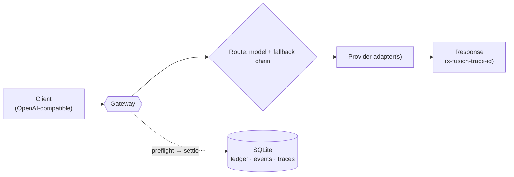

<div align="center">

# ⚡ Fusion Gateway

**An OpenRouter-style, self-hosted LLM gateway that optimizes _cost per successful task_ — not cost per token.**

One OpenAI-compatible endpoint in front of many models, with per-call cost
accounting, a budget kill-switch, replayable traces, automatic fallback — and a
**learned cost-aware router** whose research goal is **cost-quality Pareto-SOTA**.


</div>

---

> **The bet.** As models get cheaper per token but tasks get harder, the metric
> that matters is not *cost per token* — it is **cost per _successful_ task**
> (OpenAI's CFO calls it *["Useful Intelligence per
> Dollar"](https://openai.com/index/a-scorecard-for-the-ai-age/)*). Fusion
> Gateway is the engineering realization of that idea: a router that, per
> request, picks the model — or the cheap→strong **cascade** — that maximizes
> `P(correct) − λ·cost`, measured on benchmarks scored the way the *original*
> benchmark authors score them.

## Contents

- [Why this exists](#why-this-exists)
- [Headline result](#headline-result--cost-quality-pareto-sota)
- [Why you can trust the numbers](#why-you-can-trust-the-numbers)
- [What you get today](#what-you-get-today)
- [Quick start](#quick-start)
- [Configuration](#configuration) · [API](#api)
- [How it works](#how-it-works)
- [Benchmark tiers](#benchmark-tiers)
- [Engineering disciplines](#engineering-disciplines)
- [Status & roadmap](#status--roadmap)

## Why this exists

The frontier is a **cost-quality trade-off, not a single best model**. On easy
tasks a $0.0001 model is indistinguishable from a $0.004 one; on hard tasks the
expensive model earns its price. Paying frontier rates for every call wastes
money; routing everything to the cheapest model drops quality. The right answer
is **per-task**: send each request to the cheapest model *likely to get it
right*, and escalate only when it pays off.

Fusion Gateway does this behind **one OpenAI-compatible endpoint**:

- a **learned cost-aware router** picks a single model, a cheap→strong
  **cascade**, or (research) a fused panel — using **only public task features**
  (never the answer key, never an LLM judge);
- every fusion/cascade point is held to one rule: **expand the cost–quality
  Pareto frontier, or be cut**;
- and the whole thing is wrapped in production-grade governance — cost metering,
  a budget kill-switch, and a replayable trace of every decision.

## Headline result — cost-quality Pareto SOTA

On a **1063-task objective benchmark** (MMLU-Pro · MATH · HumanEval) scored with
the datasets' **official** graders — **no LLM judge** — the learned router
**Pareto-dominates** the frontier single models across the pool we tested
(DeepSeek, GLM, Kimi, Claude Sonnet/Opus, GPT-5.x):

| strategy | accuracy | cost / task | reading |
|---|---:|---:|---|
| **router @ λ=10** | **0.907** | **$0.00106** | **Pareto-dominates** GPT-5.5 · Sonnet 5 · GLM |
| claude-opus-4-8 *(quality ceiling)* | 0.913 | $0.00421 | router ≈ Opus quality at **~4× lower cost** |
| gpt-5.5 | 0.905 | — | below the router curve |
| deepseek-chat *(cost floor)* | 0.859 | $0.00011 | cheapest possible |
| **code verify-cascade** | **0.994** | ~$0.0005 | run cheap → **execute the tests** → escalate on fail |

The picture is a **frontier, not a winner**: `DeepSeek (floor) → router curve →
Opus (ceiling)`. One gateway serves the whole curve; you move along it with a
single dial (`λ`), not by swapping infrastructure. The **code verify-cascade** is
the hero — because code can be *checked by running it*, "escalate only on a
failing test" reaches near-perfect accuracy at near-cheapest cost.

> Full numbers and methodology: **[docs/BENCHMARK_REPORT.md](docs/BENCHMARK_REPORT.md)**.

## Why you can trust the numbers

Benchmark scores are worth exactly as much as their grader. This project treats
**scoring as a first-class engineering problem**:

- **Official graders, vendored with provenance.** MATH uses Hendrycks'
  `is_equiv`, MMLU-Pro uses TIGER-Lab's extraction, HumanEval uses OpenAI's
  `check_correctness` — each vendored at a pinned upstream commit with its
  license recorded. Scores are comparable to the papers, not to a scorer we
  wished into being.
- **No LLM judge.** Every task is graded objectively: MCQ letter extraction,
  math equivalence, or **sandboxed test execution**. "Correct" means *the task
  was solved*, not *an LLM liked the answer*.
- **A grader self-test.** Before any paid run, each grader must recognize every
  dataset's own gold answer (**1063 / 1063**). A grader that can't score the
  reference answer can't be trusted to score a model's.
- **Frozen, re-scorable outputs.** Every model output is persisted, so the whole
  benchmark can be **re-graded for $0** when a scorer improves — which is how
  three real scorer bugs were caught and corrected without re-spending.
- **Contamination is measured, not assumed.** A separate **hard tier** mixes
  **timestamped / post-cutoff** sources (LiveCodeBench, AIME 2025) with public
  ones, and reports a **fresh-vs-public** delta per model — a large gap flags a
  memorization suspect. Conclusions are cross-checked on genuinely-unseen data.

This is the difference between "we got a high score" and "here is a number you
can reproduce and audit." See **[docs/DISCIPLINES.md](docs/DISCIPLINES.md)**.

## What you get today

A single async gateway that speaks the **OpenAI Chat Completions API** (streaming
and non-streaming) and, per request:

- **routes** a model name to a primary + **fallback** chain (a provider outage
  falls through to the next model instead of erroring);
- **meters cost** on every call with a `preflight → settle` ledger, and **trips a
  kill-switch** when a budget cap is hit;
- writes an **append-only, replayable trace** of every decision, call, cost, and
  latency to a single SQLite file.

The learned cost-aware **routing / cascade** (the namesake) is **validated on the
benchmark** — it Pareto-dominates the frontier single models (see
[Headline result](#headline-result--cost-quality-pareto-sota)); wiring the
trained policy into the live gateway is the remaining step.

## Quick start

```bash
git clone https://github.com/coderdailyone/fusion-gateway.git
cd fusion-gateway
python3 -m venv .venv
.venv/bin/pip install -e .
```

Set your provider key(s) and an auth token, then run the gateway:

```bash
export DEEPSEEK_API_KEY=sk-...            # a key for each provider in your config
export GATEWAY_TOKENS="me:secret-token"   # client-token:principal pairs
.venv/bin/uvicorn --factory gateway.app:create_app_from_env --host 127.0.0.1 --port 8800
```

Call it exactly like the OpenAI API (`model: "auto"` uses the configured default):

```bash
curl http://127.0.0.1:8800/v1/chat/completions \
  -H "Authorization: Bearer secret-token" \
  -H "Content-Type: application/json" \
  -d '{"model": "auto", "messages": [{"role": "user", "content": "hello"}]}'
```

The response carries an `x-fusion-trace-id` header; pass `"stream": true` for SSE.
Point any OpenAI SDK at `http://127.0.0.1:8800/v1` with your gateway token.

> The gateway binds to `127.0.0.1` by default — expose it via your own reverse
> proxy or an SSH tunnel, never straight to the internet.

## Configuration

Runtime is driven by environment variables:

| Variable | Purpose | Default |
|---|---|---|
| `GATEWAY_TOKENS` | `token:principal` pairs (comma-separated); `admin` principal unlocks `/admin/*` | — (required) |
| `GATEWAY_CONFIG` | path to the TOML model/budget config | `configs/gateway.toml` |
| `GATEWAY_DB` | SQLite truth-store path | `data/gateway.sqlite` |
| `<PROVIDER>_API_KEY` | one per provider, named by its `api_key_env` | — |

Models, providers, prices, budget, and the default route live in
[`configs/gateway.toml`](configs/gateway.toml):

```toml
[budget]
active = "M1"
[budgets.M1]
cap_usd = 5.0                 # kill-switch trips at 100%, alerts at 80%

[providers.deepseek]
base_url = "https://api.deepseek.com"
api_key_env = "DEEPSEEK_API_KEY"

[models."deepseek-chat"]
provider = "deepseek"
upstream_model = "deepseek-v4-flash"
in_usd_per_mtok = 0.14
out_usd_per_mtok = 0.28
fallback = ["glm-4.6"]        # tried in order if the primary fails

[policy]
version = "static-v0"
default_model = "deepseek-chat"
```

## API

| Method & path | Auth | What it does |
|---|---|---|
| `POST /v1/chat/completions` | token | OpenAI-compatible completion; streaming supported; falls back down the chain |
| `GET /v1/models` | token | configured model names |
| `GET /healthz` | none | liveness `{"ok": true}` |
| `GET /admin/status` | admin | budget/ledger status + request counts |
| `POST /admin/killswitch/release` | admin | reset a tripped budget |

Error shapes: `401` bad token · `403` non-admin · `502 upstream_exhausted`
(whole chain failed) · `503 budget_exhausted` (budget tripped).

Inspect a running gateway's SQLite with the daily rollup:

```bash
.venv/bin/python scripts/rollup.py data/gateway.sqlite
```

## How it works



Today the **live** router is static (a model name → primary + fallbacks). The
**research** router — trained and validated offline — adds a learned cost-aware
policy that reads only public task features and chooses, per task:

1. a **single model** (cheap when the task looks easy, strong when it looks hard);
2. a cheap→strong **cascade** — run the cheap model, and for code **execute the
   tests**; escalate to the strong model only on a failing check;
3. (research) a small **panel fused only when a learned gate says it pays off**.

Every escalation/fusion point is gated on the same rule — *expand the Pareto
frontier or be cut* — and **judges and reference answers never enter routing
inputs** (the leakage guarantee is structural and tested).

Deeper docs: **[docs/DESIGN.md](docs/DESIGN.md)** (architecture + milestones) ·
**[docs/DISCIPLINES.md](docs/DISCIPLINES.md)** (engineering rules and why) ·
**[docs/POSITIONING.md](docs/POSITIONING.md)** (mapping to OpenAI's scorecard) ·
**[docs/adr/](docs/adr/)** (decision records).

## Benchmark tiers

Routing is evaluated on three complementary tiers, all under the disciplines
above:

| Tier | What | Size | Why |
|---|---|---:|---|
| **Standard** | MMLU-Pro · MATH · HumanEval, official scoring | 1063 | mixed difficulty — where routing's "cheap on easy, escalate on hard" value shows |
| **Hard** | LiveCodeBench · GPQA-Diamond · AIME 24/25 · MATH-L5 | 657 | **de-ties** the saturated frontier + a **fresh-vs-public contamination** probe |
| **Agentic** *(building)* | **SWE-bench-Live** — real GitHub issues, timestamped, graded by *do the hidden tests pass* | — | carries *cost per successful task* from single-turn benchmarks to **real work** |

The agentic tier extends the verify-cascade to a full multi-step agent loop
(read repo → edit → run tests → iterate), with the escalation gate driven by an
agent-authored **reproduction test** — never the hidden grader.

## Engineering disciplines

The project is built test-first, with rules that exist because breaking them
already cost real bugs (documented in
**[docs/DISCIPLINES.md](docs/DISCIPLINES.md)**):

- **SQLite as the single source of truth** — event-sourced ledger + traces, so
  every cost and decision is replayable, not reconstructed from logs.
- **`evaluator/` is fully isolated from the gateway** — the benchmark harness
  never imports gateway code or touches its database.
- **Frozen outputs + reference self-tests** — re-grade for $0; prove the grader
  before spending; a free/cheap gate before every paid run.
- **Every design goes spec → plan → reviewed implementation**, with decision
  records in **[docs/adr/](docs/adr/)**.

## Status & roadmap

Active, test-driven development.

| Milestone | State |
|---|---|
| **M0** governance & disciplines | ✅ done |
| **M1** minimal gateway (this README) | ✅ code complete; deploy pending |
| **M2** objective benchmark + official-aligned scoring (standard, 1063 tasks) | ✅ done |
| **M2d** hard / contamination-resistant tier (657 timestamped tasks) | ✅ done |
| **M3** learned cost-aware router + code verify-cascade | ✅ done — Pareto-dominant |
| **M4** SWE-bench-Live agentic tier (long-task routing) | 🚧 in progress |

## Tech

Python 3.10+ · FastAPI · httpx · SQLite (WAL) — a single async process, no ORM,
no queue, no Docker in the gateway core. The evaluator adds LiteLLM / datasets /
sympy (an `[eval]` extra) — and, for the agentic tier, an isolated Docker eval
box — all fully decoupled from the gateway core.

## License

TBD.
